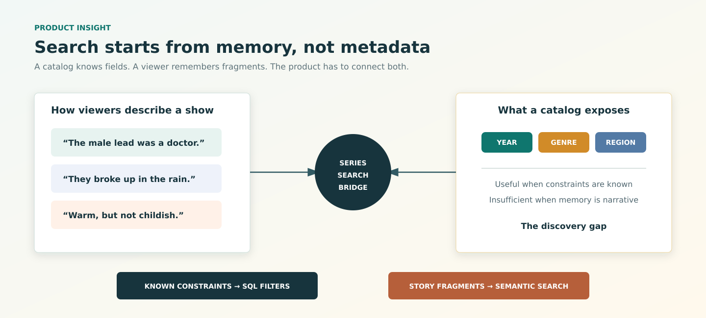
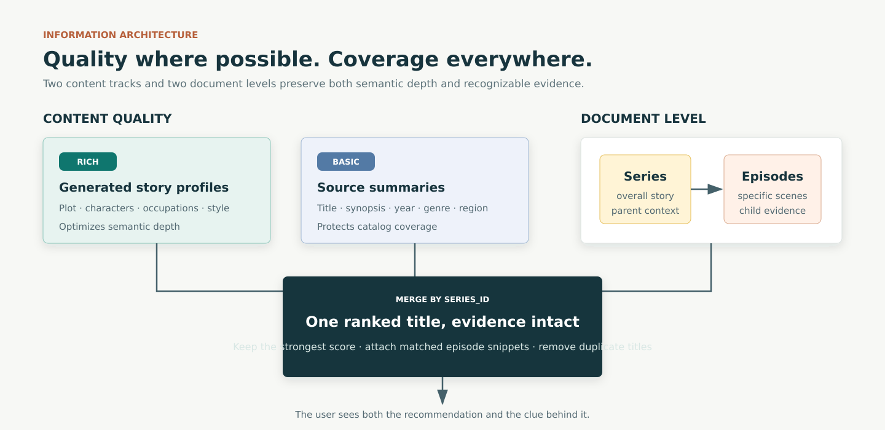
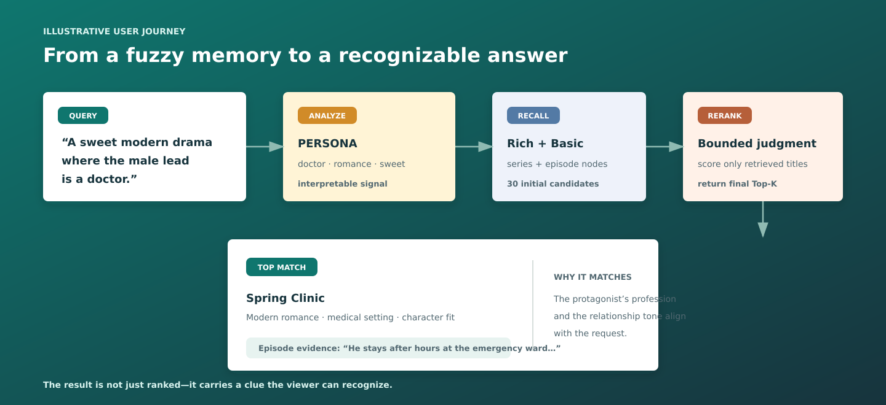
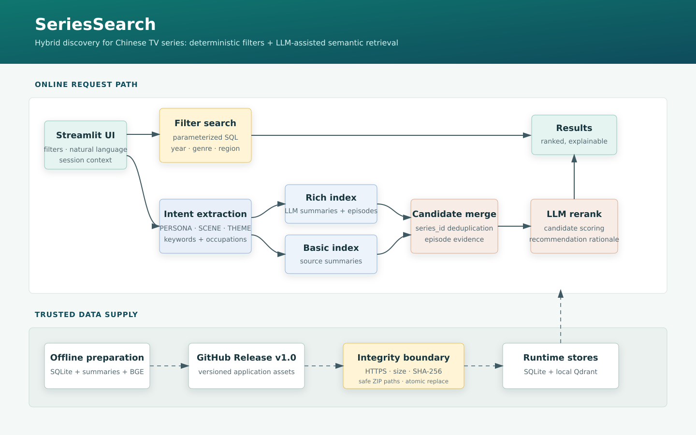

# SeriesSearch

**Find a show from the character, scene, or feeling you remember.**

[](https://github.com/lyf-Felicia/SeriesSearchApp/actions/workflows/ci.yml)
[](LICENSE)
[](https://www.python.org/)

SeriesSearch is a Streamlit retrieval product for TV series discovery. It combines precise year/genre/region filtering over SQLite with natural-language search over rich and basic Qdrant indexes, then uses an OpenAI-compatible LLM for intent extraction, bounded candidate reranking, and recommendation explanations.



## Product Idea

Traditional catalog search assumes the user knows what to filter. SeriesSearch also serves the fuzzier moment when someone only remembers **who**, **what happened**, or **how the story felt**.

That leads to two deliberate entry points: SQL filters for known constraints, and semantic search for narrative memory. The goal is not just a ranked title—it is a recognizable clue that helps the user say, “yes, that is the show.”

## Three Design Moves



1. **Quality + coverage:** enriched story profiles improve semantic depth; source summaries keep the long tail searchable.
2. **Title + scene:** series documents capture the whole story; episode documents recover specific remembered moments.
3. **Recall + judgment:** embeddings retrieve broadly; the LLM only reranks a bounded set and explains the result.

Intent classification currently makes the query analysis visible; it does **not** route retrieval. Every semantic query searches both indexes, while dynamic routing remains an isolated experiment.

## One Search, End to End



The example is illustrative, not a benchmark result. Within one browser session, follow-up queries also carry recent turns into retrieval and recommendation generation.

## Product and Engineering Tradeoffs

| Decision | Benefit | Current limitation / next validation |
|---|---|---|
| Local BGE embeddings and Qdrant | Chinese semantic retrieval without sending the corpus to an embedding API | Model download and local index increase cold-start and memory cost |
| LLM reranking after retrieval | Applies nuanced judgment to a small candidate set | Needs an offline relevance benchmark and latency/cost measurement |
| Session-scoped conversational context | Enables lightweight iterative discovery without accounts | Context is string-based, short-lived, and not a durable preference model |
| Live poster lookup | Makes results recognizable without bundling image assets | Third-party availability and licensing require a production replacement |
| Versioned Release assets | Keeps large artifacts outside Git while preserving reproducibility | First boot is multi-gigabyte; production should pre-stage assets |
| Deliberately narrow production path | Keeps the shipped experience understandable and testable | HyDE, local reranking, and rule-based routing remain isolated experiments until evaluated |

The scope extends beyond model integration: query UX, corpus modeling, ranking, evidence presentation, artifact security, and data governance are all represented in the repository. No unsupported accuracy, latency, or memory claims are published.

## Evaluation Plan

The next question is whether this design helps users identify the right show with less effort:

| Dimension | Proposed measure | Decision it informs |
|---|---|---|
| Retrieval coverage | `Recall@15` on persona, scene, and theme query sets | Whether both indexes retrieve a relevant candidate before reranking |
| Ranking quality | `NDCG@5` / human relevance preference | Whether LLM reranking improves over vector-score ordering |
| Evidence quality | Precision of surfaced episode snippets | Whether users can recognize why a result matched |
| User success | Result-detail engagement, reformulation rate, and successful-session rate | Whether the interaction model reduces search effort |
| Operational quality | p50/p95 latency, LLM parse-failure rate, fallback rate, and cost per search | Whether the experience is viable beyond a demo |

The first ablation compares basic-only retrieval, dual-index retrieval, and dual-index plus LLM reranking—testing whether each layer earns its complexity.

## Architecture



### Online application

- `src/app.py` owns the Streamlit interface, session state, semantic orchestration, and result presentation.
- `src/filter_search.py` owns parameterized SQLite filtering.
- `src/release_assets.py` owns the trusted asset boundary: fixed repository/tag, HTTPS host allowlist, byte-size and SHA-256 verification, bounded ZIP extraction, and atomic replacement.
- Local Qdrant stores `tv_series_rich_text` and `tv_series_basic`; SQLite serves deterministic filters.

### Offline data path

`src/data_loader.py` converts series and episode records into LlamaIndex documents. `src/index_builder.py` embeds them with `BAAI/bge-large-zh-v1.5` and builds the two Qdrant collections with batching and checkpoints.

### Experimental code

The following modules are research prototypes and are **not connected to the production Streamlit entry point**:

- `scripts/retriever.py`: Lightning/Deep/Filter modes, optional HyDE, and a local BGE reranker.
- `scripts/app_router.py`: rule-based routing that still references legacy modules.
- `src/query_engine.py`: an alternate Ollama/LlamaIndex query prototype.

## Repository Layout

```text
SeriesSearchApp/
├── src/
│   ├── app.py                 # production Streamlit entry point
│   ├── filter_search.py       # testable SQLite filter service
│   ├── release_assets.py      # verified Release download/extraction
│   ├── data_loader.py         # SQLite/summary to document pipeline
│   ├── index_builder.py       # offline dual-index builder
│   └── query_engine.py        # experimental Ollama path
├── scripts/                   # collection, preparation, and experiments
├── tests/                     # offline security and SQL contract tests
├── docs/architecture.svg      # product and data-supply architecture
├── .github/workflows/ci.yml   # compile, pytest, and Gitleaks checks
├── DATA_POLICY.md             # third-party data and model boundaries
└── SECURITY.md                # disclosure and secret-handling policy
```

## Setup

### Prerequisites

- Python 3.11
- At least 6 GB of free disk space for downloaded assets, extraction, and model cache
- An OpenAI-compatible API endpoint and key
- Network access to GitHub Releases and the configured embedding-model source

```bash
git clone https://github.com/lyf-Felicia/SeriesSearchApp.git
cd SeriesSearchApp
python3.11 -m venv .venv
source .venv/bin/activate
python -m pip install --upgrade pip
python -m pip install -r requirements.txt
cp .streamlit/secrets.toml.example .streamlit/secrets.toml
```

Set `LLM_API_KEY` in `.streamlit/secrets.toml`. The file is ignored by Git.

```toml
LLM_API_KEY = "your-provider-key"
LLM_BASE_URL = "https://dashscope.aliyuncs.com/compatible-mode/v1"
LLM_MODEL_NAME = "qwen-max"
QDRANT_PATH = "data/qdrant_data"
EMBEDDING_MODEL_PATH = "BAAI/bge-large-zh-v1.5"
DB_PATH = "data/database/final.db"
```

## Run

```bash
streamlit run src/app.py
```

On the first start, the application downloads approximately 2.55 GB of versioned data assets from GitHub Release `1.0`. It verifies exact sizes and SHA-256 digests before installing them. The embedding model is fetched separately if it is not already cached.

## Verification

The offline suite does not require the large Release assets or an API key.

```bash
python -W error -m compileall -q src scripts
python -m pytest -q
```

Coverage currently focuses on the highest-risk local boundaries: SQL filter behavior and injection resistance, Release hash validation, streamed atomic downloads, ZIP path traversal, symlink rejection, and validated directory replacement. LLM and Qdrant integration tests remain roadmap work.

## Deployment

See [DEPLOYMENT.md](DEPLOYMENT.md) for resource requirements and a release checklist. The code is structured for Streamlit hosting, but a successful production deployment has not yet been verified in CI because startup requires multi-gigabyte assets, model download, and a live LLM credential.

## Security and Data Use

- Secrets belong only in Streamlit Secrets or another deployment secret manager.
- Search text is sent to the configured LLM provider. Review its retention policy before deployment.
- The MIT license applies to source code, not third-party metadata, plot text, images, model weights, or Release assets.
- Review [SECURITY.md](SECURITY.md) and [DATA_POLICY.md](DATA_POLICY.md) before public or commercial deployment.

## Roadmap

- Add mocked LLM/Qdrant integration tests and a small redistributable demo fixture.
- Add a pure-vector fallback when the LLM provider is unavailable.
- Replace live poster discovery with an explicitly licensed image catalog.
- Benchmark retrieval quality, latency, and reranking contribution before publishing performance claims.
- Move long asset preparation out of the request-serving process for production deployments.

## License

Source code is released under the [MIT License](LICENSE). Third-party data and model artifacts are governed separately as described in [DATA_POLICY.md](DATA_POLICY.md).
